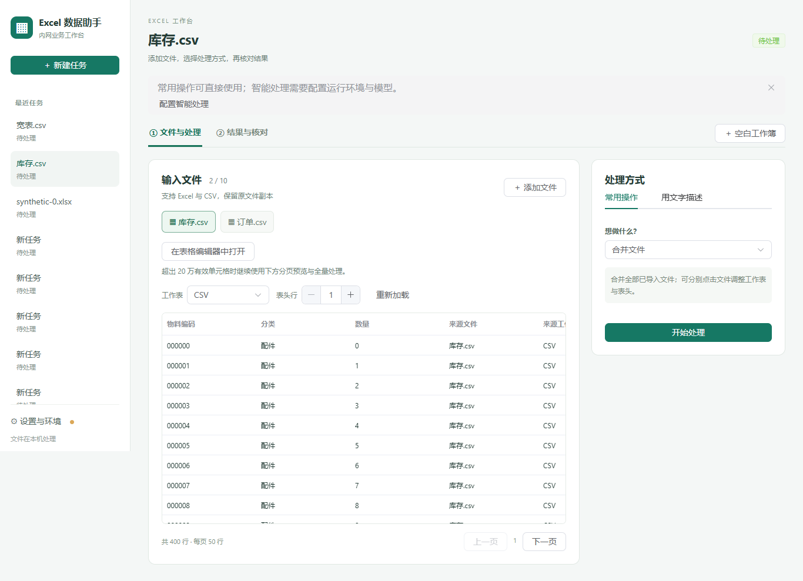
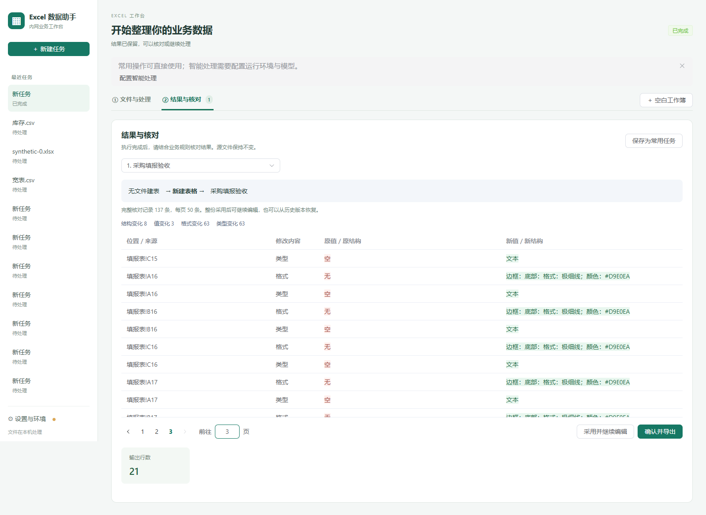

# 业务工作台使用说明

## 从文件到结果

1. 新建任务，选择 Excel 或 CSV。应用复制输入文件，原文件不会被覆盖。
2. 点击文件，确认工作表与表头行。预览每页 50 行；大文件先显示已读取的数据，总行数在索引完成后出现。预览不等于完整校验。
3. 在“常用操作”选择处理方式。关联与对账明确选择主表、补充表；模板填写明确选择数据与模板。不同表头和工作表需要分别点击对应文件调整。
4. 点击“开始处理”，等待真实进度。无需模型的操作始终从此入口执行；Excel 原生重算需要本机 Excel。
5. 在“结果与核对”检查完整差异、行数、问题和来源。点击“采用并继续编辑”或“确认并导出”整份采用候选；导出使用本机保存对话框另存新文件。旧结果没有差异记录时明确提示，并保留分页预览和 Excel 打开入口。没有提供的统计不会显示为零。
6. 成功任务可保存为常用任务。复用时按保存的输入顺序准备替换文件；无文件建表规则不需要输入文件。

内置编辑器支持手动输入、格式、公式、多工作表、草稿和历史。切换任务或工作簿、开始 AI 和导出前会先保存；保存失败显示“未保存”并保留当前编辑内容。已采用结果继续修改后，需要重新核对当前版本再导出。详见 [编辑器使用说明](WORKBOOK_EDITOR.md)。

“用文字描述”需要在“设置与环境”配置 Agent 与模型。运行环境验证和模型连接测试是两件事；待确认问题可以选择选项或补充业务规则。

## 环境与故障处理

“设置与环境”按使用状态、模型连接、高级诊断分类。首次启动不自动执行完整协议检查；点击高级诊断可自动验证已有安装，或明确选择内置组合。关闭设置抽屉不取消正在进行的检测，重新打开继续显示状态。

预览缓存损坏或输入副本变化时，点击“重新加载”。缓存存放在应用任务目录的 `preview-cache/`，总容量默认 1 GB；完整缓存按最近使用淘汰，不删除输入、输出或任务数据库。缓存已满时仍可执行正式处理。当前一次执行一个业务任务，执行期间停止预览索引，结果就绪后自动恢复预览。

历史任务每次显示 30 条，消息每次显示最近 200 条，可按页查看更早内容。终态任务停止后台轮询；应用隐藏时降低轮询频率。

## IT 与开发验证

| 命令 | 用途 |
| --- | --- |
| `.venv\Scripts\python.exe -m unittest discover -s tests -v` | 业务、预览缓存、协议与故障回归；完整验证设置 `REQUIRE_QWEN_CLI=1` |
| `npm run build --prefix gui` | TypeScript 和前端构建 |
| `.venv\Scripts\python.exe scripts/benchmark_workbench.py` | 三份十万行、30 列合成 Excel 的读取、预览、合并和导出测量 |
| `.venv\Scripts\python.exe scripts/workbench_ui_server.py` | 启动仅监听本机的合成测试服务，十分钟后自动关闭；不使用客户任务 |
| `node scripts/workbench_ui_smoke.cjs` | 浏览器真实 RPC 回归；通过 `PLAYWRIGHT_MODULE` 指向本地 Playwright 模块，可配置 `CHROME_EXECUTABLE` |
| `.venv\Scripts\python.exe scripts/smoke_frozen_preview.py` | 验证便携包的实际预览子进程与十万行 CSV 分页 |

先运行大文件基准，再运行 UI 测试脚本，执行十万行 Excel 的 50 次端到端翻页测量。各 UI 脚本自行启动独立合成测试服务，结束时关闭服务与预览子进程；也可单独运行测试服务供人工检查。测试结果写入被 Git 忽略的 `build/`。所有验证优先本地运行，不触发 GitHub CI。

## 合成数据界面

