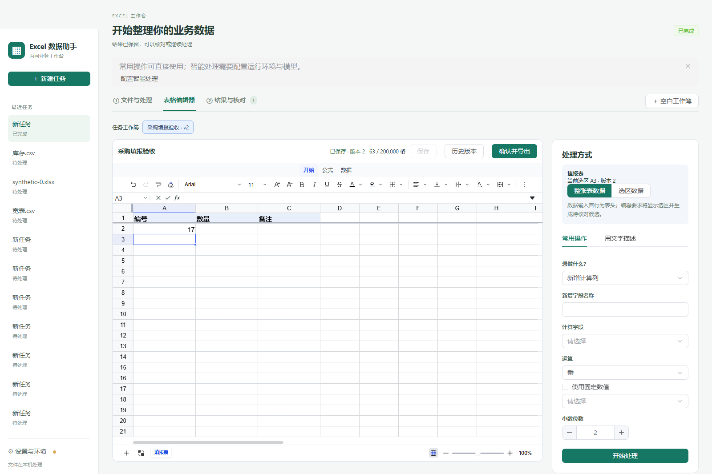

# 内置表格编辑器与 AI 工作台

本机工作簿编辑使用 Univer 0.25.1 的 Apache-2.0 开源插件。编辑器按需加载；没有转换服务、协作服务或商业组件。Python 使用 openpyxl 导入、XlsxWriter 导出，全部数据保留在任务目录与本机任务数据库中。

## 使用流程

| 场景 | 操作 |
| --- | --- |
| 编辑已有文件 | 添加 Excel/CSV →“在表格编辑器中打开”。任务工作簿入口可以重新打开最近保存的草稿。|
| 大文件处理 | 超过 200000 个有效单元格时使用文件分页预览及常用操作/智能处理；结果与差异仍可核对至最后一页。|
| 手动建表 | 点击“空白工作簿”。也可在常用操作中选择“无文件建表”，填写表头，生成表头及 20 行空白填报区域。|
| 无文件智能建表 | 用文字明确表头、工作表名称及已知数据。缺失业务数字留空；只有明确要求示例时才生成并标注示例表。|
| 新增计算列 | 选择依据字段、运算及小数位，写入数值结果。支持结构化组合规则；重复字段名直接拒绝。|
| 条件分级 | 按顺序匹配条件并写入文本标签。空值、非法数字或除零保留原行、输出空结果并记录来源和原因。|
| 基于编辑内容处理 | 编辑器右侧明确显示工作表、选区与版本。数据操作可以使用整表实际数据或选区；首行为表头。AI 区域编辑绑定当前选区。|
| 核对候选 | 查看“输入→操作→结果”卡片、值/公式/格式/结构差异。默认每页 50 条，RPC 最多 200 条；计算和清洗有旧值→新值，汇总/矩阵转换明确表示结构变化。|
| 采用候选 | “采用并继续编辑”整份采用为新版本。处理期间工作簿只读；失败、取消或过期候选不能覆盖当前版本。|
| 另存结果 | “确认并导出”使用本机保存对话框，以新文件名保存 `.xlsx`。取消、失败不标记导出；已有文件不会覆盖。已采用但未继续修改的候选可以直接确认导出；继续编辑使旧确认失效，需要打开当前版本重新核对。|
| 版本恢复 | “历史版本”中可先只读查看，再恢复指定版本，创建新版本并保留历史记录。每个草稿修订也可追溯；当前编辑会话内使用原生撤销重做。|
| 常用规则 | 文件输入的计算/分级可按原输入槽位保存；无文件建表是零输入规则。手工编辑、工作簿选区及中间输出链暂不自动转为可复用规则。|

## 文件与公式边界

| 范围 | 行为 |
| --- | --- |
| 有效单元格 | 值、公式、独立格式取并集，最多 200000 格；整行整列公共样式不展开计数。导入、粘贴、格式及候选应用前检查。|
| 常规 XLSX | 保留值、公式、格式、工作表顺序、行列尺寸/隐藏、合并、冻结和按值筛选。日期使用明确的 1900/1904 纪元转换；保留 Excel 日期序列 60。|
| CSV | UTF-8（含 BOM）或 GB18030；编号、前导零、NA 以及以 `=` 开头的内容作为文本。CSV 数字文本参与 SUM 等公式时遵循 Excel 的文本语义，需要时可手动转数值。|
| XLS | 只提供纯数据转换入口并显示限制；原公式和格式不承诺往返。|
| 首批公式 | SUM、AVERAGE、MIN、MAX、COUNT、COUNTA、IF、IFERROR、AND、OR、ROUND、SUMIF、COUNTIF、VLOOKUP、INDEX、MATCH，以及相对/绝对/跨表引用。支持范围由后端白名单控制。|
| 公式缓存 | 表达式与结果分开保存；保存等到内核结果应用完成。通过依赖图检测循环及其受影响公式，不接受内核默认的迭代零值。未计算、循环引用和公式错误明确显示；有公式错误或缺失缓存时阻止导出，绝不使用默认零缓存。|
| 复杂对象 | 检出图表、透视、宏/外链、图片/嵌入对象、分段文字格式、行列分组、命名区域、条件格式/数据验证、保护、复杂打印配置、不支持的公式等时只读查看并列出限制。用户可明确提取纯数据副本；无有效公式缓存时拒绝提取。|
| 高级筛选 | 首版格式闭环支持按值筛选。颜色/复杂条件筛选不进入已验证兼容范围；不能静默保存丢失。|

界面中未纳入上述适配范围的内核功能不视为文件兼容承诺。Excel 2016 的打开/重算/无修复提示、客户断外网环境和业务样本仍需要客户环境实测。

## 保存与任务安全

草稿在停止编辑 1 秒后保存，连续编辑最多间隔 10 秒触发保存。运行 AI、切换和导出前强制完成当前修改保存。SQLite WAL 事务将压缩快照与版本号同时提交，期望版本不一致时明确报告“未保存/版本冲突”。失败不替换旧草稿。

计算和分级只有字段、数值、运算、比较及条件组合节点，没有 eval、生成 Python、Shell 或 VBA。AI 工作簿编辑只接受写值、设置常用格式、新建表和改名，不接受任意内核命令。采用及导出只通过用户界面 RPC 调用，不属于模型工具。

一次执行有独立编号。只有完整成功的执行才能采用其候选；失败或取消的候选在后续执行成功后也不会恢复为可采用状态。输入工作簿版本、选区及来源行号保留在处理记录中。

## 本机验证记录（2026-09-14）

| 验证 | 结果与复现 |
| --- | --- |
| 格式、状态、规则单元测试 | `python -m unittest tests.test_workbooks -v`；覆盖格式/日期/公式缓存、容量并集、CAS、恢复、失败回滚、取消与过期候选、计算异常、无文件建表和编辑范围。|
| 浏览器工作台 | `scripts/workbook_ui_smoke.cjs`：实际中文/数字/公式输入、剪贴板、查找替换、历史只读查看、自动保存、循环引用保存/导出保护、16 个首批函数及跨表绝对引用；`WORKBOOK_CAPACITY=1` 增加 20 万格完整编辑与超限拦截。|
| 编辑内核 | `scripts/workbook_engine_smoke.cjs`：原生撤销重做、字体/金额/百分比、行列、合并、冻结、工作表增删改排序、公式、筛选、排序、填充及整列公共样式/数字格式；使用本地测试页，不加入应用入口。|
| 候选工作台 | `scripts/workbook_review_ui_smoke.cjs`：无文件建表、差异末页核对、整份采用、继续编辑和重新打开。|
| 实际 WebView2 | `scripts/smoke_webview_workbook.py`：隐藏的真实 edgechromium 窗口，内核公式、原生 PPX RPC 自动保存及本机 xlsx 导出；记录资源请求，未发现外网请求。|
| 容量与全量处理 | 20 万格完整导入、编辑、保存、导出及超限拦截；十万行完整差异和末页来源校验通过。详细数字见 [性能记录](PERFORMANCE.md)。|
| 切换与失败恢复 | `scripts/workbook_lifecycle_ui_smoke.cjs`：延迟响应隔离、保存失败阻止切换、重试保留修改、导出取消、反复打开销毁编辑器。|
| 完整回归与便携包 | 以 [最终验证记录](VALIDATION.md) 的实际运行结果为准，包含固定真实 CLI 和本地模拟模型；不代表客户模型能力。|

测试产物（截图、快照、指标）仅含合成数据，位于忽略的 `build/`。性能复现脚本为 `scripts/benchmark_workbook_editor.py`。各 UI 脚本自动启动独立合成测试服务并在结束时清理。Playwright 脚本通过 `PLAYWRIGHT_MODULE` 和 `CHROME_EXECUTABLE` 使用已有测试运行时。

## 开源参考与交付

| 参考 | 采用内容 |
| --- | --- |
| [Univer](https://github.com/dream-num/univer) | 0.25.1 开源编辑、渲染、公式、数字格式、排序、筛选和查找替换插件。|
| [Grist](https://support.getgrist.com/imports/) | 旧值/新值并排、突出新增和修改的核对方式。|
| [OpenRefine](https://github.com/OpenRefine/OpenRefine) | 历史步骤、规则说明及异常定位。|
| [Data Formulator](https://github.com/microsoft/data-formulator) | 输入→操作→结果的步骤卡片和继续处理入口。|
| [FortuneSheet](https://github.com/ruilisi/fortune-sheet) / [FormulaAI](https://formulaai.net/zh) | 已评估候选及场景展示参考；未引入第二套内核或相关服务。|

184 个前端运行依赖的版本与许可证见 `vendor/licenses/gui/manifest.json`。部分 npm 包没有单独许可证文件，保留其 README 许可段、package.json 与上游补充正文。未修改 Univer 上游源码；稀疏公共样式处理在应用适配层。

使用原有 `scripts/build.py` 构建 Windows 便携目录。本说明、依赖许可证和对应源码随包交付。源码归档仍只使用 Git 跟踪清单；新源码须加入跟踪清单后生成交付包，不扫描任务数据或本地配置。没有自动触发 GitHub Actions。

## 合成数据编辑界面

